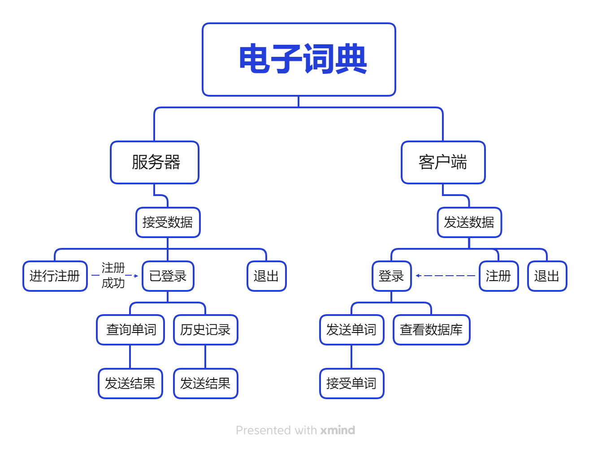

# **项目需求**

1. 将dict.txt的数据导入到**数据库**中保存
2. 登录注册功能，不能重复登录，重复注册
3. 单词查询功能
4. 历史记录功能，存储单词，意思，以及查询时间
5. 基于**TCP**，支持多客户端连接
6. 采用数据库保存用户信息与历史记录
7. 按下ctrl+c退出客户端后，注销该客户端的登录信息

# 项目逻辑

# 通信协议

- 用户注册：发送数据第一位为**0**，后跟用户名**`usr`**或**`passwd`**字符串数据。

​		如果注册成功返回**1**，注册失败返回**0**。

- 用户登录：

##### 

# 函数模块

#### 客户端：

- 用户注册**do_register**：返回0表示函数运行成功，返回-**1**表示函数运行出错，返回-**2**表示连接已断开需要重新连接。

#### 服务端：

- 处理用户注册

